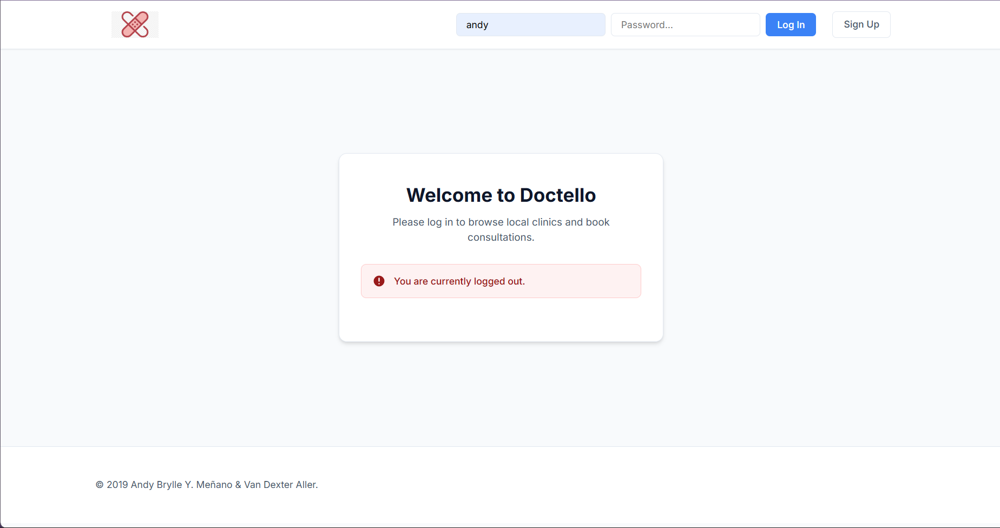
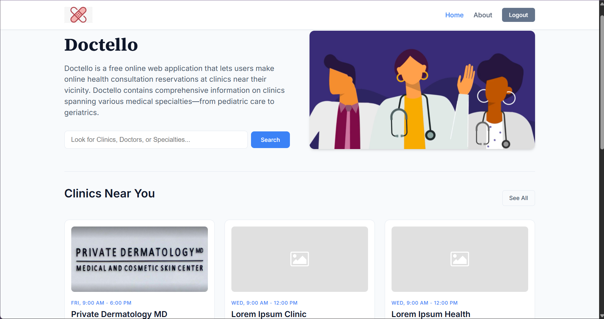
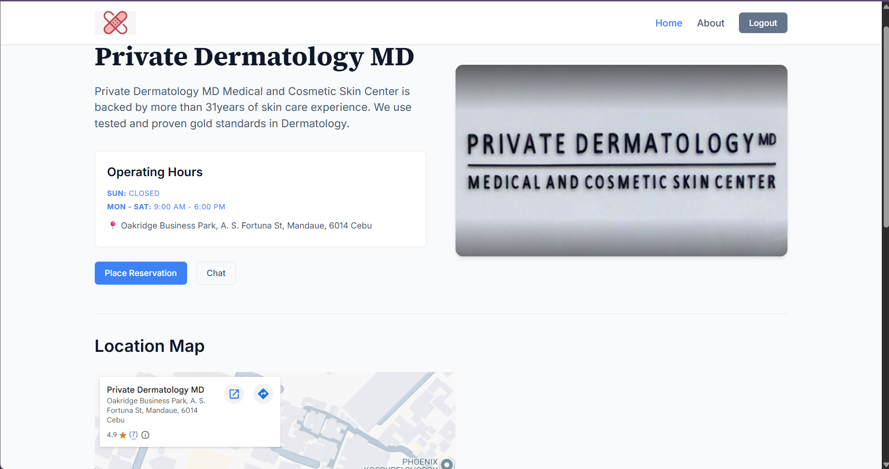
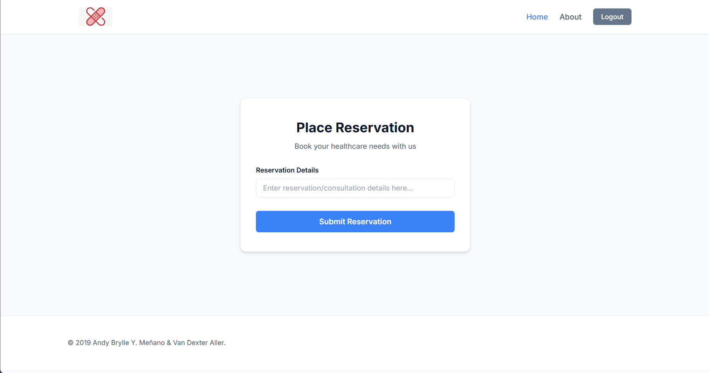

# Screenshots

# Project Overview
A first year college project into the basic introduction of web development. Doctello is a web application designed for making online healthcare consultations/reservations between patients and healthcare professionals. It also comes with an incomplete live chat system and maps to nearby clinics and/or laboratories.

# Tech Stack
- HTML
- CSS
- JavaScript
- PHP
- MySQL

# How to use:
1. Clone repository into htddocs folder.
2. Start Apache and MySQL in XAMPP Control Panel.
3. Open project in browser: localhost:port-number/doctello